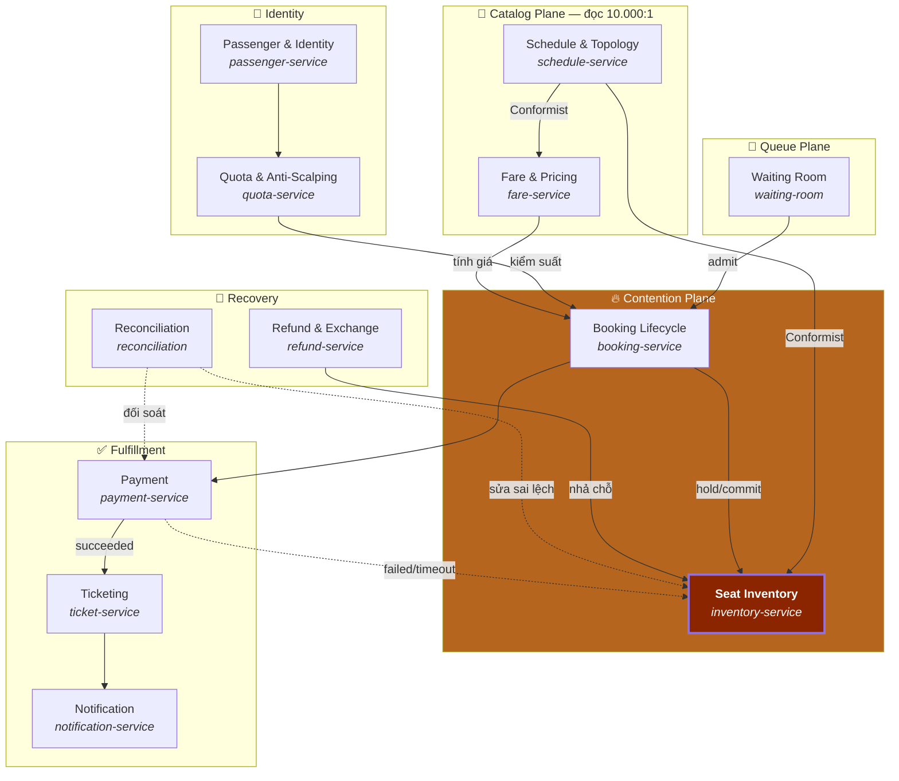

# 01 — Domain Model

## 1. Yêu cầu

| ID | Yêu cầu | Loại | Ghi chú |
|---|---|---|---|
| R1 | Tra cứu chuyến theo ga đi, ga đến, ngày | Chức năng | Đọc rất nhiều |
| R2 | Xem sơ đồ chỗ còn trống **cho đúng hành trình của mình** | Chức năng | Không phải "chỗ trống trên tàu" — mà "trống trên các chặng tôi đi" |
| R3 | Giữ chỗ tạm để kịp thanh toán | Chức năng | Hết hạn thì tự nhả |
| R4 | Thanh toán qua VNPay/MoMo | Chức năng | Bên thứ ba, bất đồng bộ, có thể timeout |
| R5 | Nhận vé điện tử có mã QR | Chức năng | |
| R6 | Đổi / trả vé theo chính sách | Chức năng | Chỗ phải quay lại kho **đúng các chặng đã chiếm** |
| R7 | Đặt nhiều vé cho cả nhà, **ngồi/nằm cạnh nhau** | Chức năng | Ràng buộc phân bổ |
| **R8** | **Không bao giờ bán thừa một vé** | **Bất biến** | ⭐ Tội nặng nhất |
| **R9** | **Mỗi CCCD tối đa 4 vé/chiều trong đợt Tết** | **Bất biến** | Chống đầu cơ |
| R10 | Mở bán theo đợt, công bằng | Chức năng | Phòng chờ ảo |
| R11 | Tàu huỷ/hoãn ⇒ thông báo + hoàn tiền tự động | Chức năng | Saga ngược hàng loạt |

### Phi chức năng — đây mới là chỗ khó

| ID | Yêu cầu | Chỉ tiêu |
|---|---|---|
| **N1** | **Chịu được đợt mở bán** | 500.000 người trong 60 giây |
| N2 | Giữ chỗ thành công | p99 < 800 ms |
| N3 | Tra cứu chuyến | p95 < 150 ms (cache) |
| **N4** | **Bán thừa vé** | **Đúng 0. Không có "chấp nhận được"** |
| N5 | Trừ tiền mà không có vé | 0 — hoặc hoàn trong 5 phút |
| N6 | Phòng chờ công bằng | Thứ tự vào = thứ tự đến, sai lệch < 1% |
| N7 | Redis chết | Không mất chỗ đã thanh toán |

> **N4 là ràng buộc định hình toàn bộ hệ thống.** Mọi quyết định kiến trúc khác đều là
> hệ quả của việc bảo vệ nó. Trong domain này, *chậm* là phiền; *sai* là vỡ trận —
> hai người cùng cầm vé cho một giường trên chuyến tàu 33 tiếng.

---

## 2. Event Storming

```
━━━ CHUẨN BỊ (trước đợt bán) ━━━━━━━━━━━━━━━━━━━━━━━━━━━━━━━━━━━━━━━━━━━━━━━━
 [Lập lịch chạy tàu]──▶ TripScheduled
        │  (SE1 chạy ngày 14/02, thành phần toa X, Y, Z)
        ▼
 [Sinh tồn kho chỗ]──▶ InventoryInitialized
        │  500 chỗ × bitmask 29 chặng, nạp vào Redis + PostgreSQL
        ▼
 [Công bố lịch mở bán]──▶ SaleWindowAnnounced
        │  ⚠ HOTSPOT: ai cũng biết 8:00 sáng mai mở bán
        │    → 500k người chờ sẵn ở giây thứ 0
        ▼
 SaleWindowOpened

━━━ VÀO HÀNG ━━━━━━━━━━━━━━━━━━━━━━━━━━━━━━━━━━━━━━━━━━━━━━━━━━━━━━━━━━━━━━━
 [Xin vào phòng chờ]──▶ QueueTicketIssued
        │  ⚠ HOTSPOT: bot xin 10.000 vé hàng đợi
        │    → giải: buộc xác thực CCCD TRƯỚC khi vào hàng
        ▼
 [Đến lượt]──▶ AdmittedToBooking
        │  Xả N người/giây vào hệ thống thật
        ▼
 QueueTicketExpired  (không dùng trong 15 phút)

━━━ ĐẶT CHỖ ━━━━━━━━━━━━━━━━━━━━━━━━━━━━━━━━━━━━━━━━━━━━━━━━━━━━━━━━━━━━━━━━
 [Tìm chuyến]──▶ TripSearched
        ▼
 [Xem chỗ trống cho hành trình]──▶ AvailabilityQueried
        │  ⚠ HOTSPOT: kết quả cũ trong 2 giây → user bấm chỗ đã bị người khác lấy
        │    → giải: coi hiển thị là GỢI Ý, quyết định thật nằm ở lúc giữ chỗ
        ▼
 [Giữ chỗ]──▶ BerthHeld          |  BerthHoldRejected (đã có người)
        │  ⚠⚠ HOTSPOT LỚN NHẤT: 10.000 request cho cùng 1 giường
        │     → toàn bộ doc 03 và 04 xoay quanh đây
        ▼
 [Kiểm tra suất mua]──▶ QuotaChecked | QuotaExceeded
        │  ⚠ HOTSPOT: cò vé dùng 50 CCCD mượn
        ▼
 [Tạo đơn]──▶ BookingCreated
        │  Đơn = 1 lần thanh toán, có thể nhiều vé
        ▼
 HoldExpiring (còn 3 phút)  ──▶  HoldExpired ──▶ BerthReleased
        │                          ⚠ HOTSPOT: hẹn giờ phân tán cho 100k hold
        ▼
━━━ THANH TOÁN ━━━━━━━━━━━━━━━━━━━━━━━━━━━━━━━━━━━━━━━━━━━━━━━━━━━━━━━━━━━━━
 [Chuyển sang cổng thanh toán]──▶ PaymentInitiated
        │
        ├──▶ PaymentSucceeded ──▶ [Xuất vé]──▶ TicketIssued ──▶ TicketDelivered
        │
        ├──▶ PaymentFailed ─────▶ [Nhả chỗ]──▶ BerthReleased
        │
        └──▶ PaymentTimeout ────▶ ⚠⚠ HOTSPOT: đã trừ tiền nhưng ta không biết
             │                      → giải: đối soát + hoàn tự động
             ▼
        PaymentReconciled | RefundIssued

━━━ SAU KHI CÓ VÉ ━━━━━━━━━━━━━━━━━━━━━━━━━━━━━━━━━━━━━━━━━━━━━━━━━━━━━━━━━━
 [Đổi vé]──▶ TicketExchanged     (nhả mask cũ, chiếm mask mới — NGUYÊN TỬ)
 [Trả vé]──▶ TicketRefunded ──▶ BerthReleased
 [Lên tàu]──▶ TicketScanned ──▶ TicketUsed

━━━ SỰ CỐ ━━━━━━━━━━━━━━━━━━━━━━━━━━━━━━━━━━━━━━━━━━━━━━━━━━━━━━━━━━━━━━━━━━
 [Tàu hoãn]──▶ TripDelayed ──▶ (thông báo hàng loạt)
 [Tàu huỷ]──▶ TripCancelled
        │  ⚠ HOTSPOT: 500 vé phải hoàn tự động + gợi ý chuyến thay thế
        ▼
 BulkRefundInitiated ──▶ RefundIssued × N

━━━ NỀN ━━━━━━━━━━━━━━━━━━━━━━━━━━━━━━━━━━━━━━━━━━━━━━━━━━━━━━━━━━━━━━━━━━━━
 [Đối soát Redis ↔ PostgreSQL]──▶ DriftDetected ──▶ InventoryRepaired
        ⚠ HOTSPOT: hai kho dữ liệu, một sự thật. Doc 04 §6
```

### Bảng hotspot — quyết định thiết kế

| Hotspot | Vấn đề | Quyết định |
|---|---|---|
| **Đợt mở bán** | 500k người ở giây thứ 0 | **Phòng chờ ảo**: hấp thụ sóng, xả đều N người/giây. Backend không bao giờ thấy đợt sóng |
| **Tranh một giường** | 10k request, 1 chỗ | Redis + Lua nguyên tử, phân vùng theo chuyến. [04](04-contention-strategies.md) |
| Bot xin vé hàng đợi | Cò vé lấy 10k slot | Xác thực CCCD **trước** khi vào hàng, không phải lúc thanh toán |
| Hiển thị chỗ trống bị cũ | User bấm chỗ đã mất | Hiển thị là **gợi ý**, không phải cam kết. UI nói rõ. Quyết định thật ở lúc giữ chỗ |
| Hẹn giờ 100k hold | Hết hạn phải nhả đúng lúc | Redis TTL + keyspace notification, có job quét dự phòng |
| Thanh toán timeout | Trừ tiền mà ta không biết | **Đối soát bắt buộc** — không phải tính năng phụ |
| Cò vé dùng CCCD mượn | Quota theo danh tính bị lách | Chấp nhận không chặn được 100%; giới hạn thiệt hại + phát hiện theo cụm hành vi |
| Đổi vé | Nhả chặng cũ, chiếm chặng mới | Phải **nguyên tử** — nếu không, đổi vé thất bại giữa chừng làm mất cả chỗ cũ lẫn mới |
| Redis chết | Mất hold chưa kịp ghi PostgreSQL | Hold **chưa thanh toán** mất là chấp nhận được; vé **đã thanh toán** thì không bao giờ |

---

## 3. Bounded Contexts



### Quan hệ giữa context

| Thượng nguồn → Hạ nguồn | Kiểu | Lý do |
|---|---|---|
| Schedule → Inventory | **Conformist** | Inventory dùng nguyên cấu trúc chặng của Schedule. Tách ra là thừa |
| Booking → Inventory | **Customer/Supplier** | Booking là khách hàng duy nhất được ghi vào Inventory |
| Quota → Booking | **Open Host** | Quota phục vụ nhiều client, giao diện ổn định |
| Reconciliation → Inventory | **Đường vòng có chủ đích** | Chỉ context duy nhất được **sửa** tồn kho ngoài luồng chính |
| Payment → Booking | **Anti-Corruption Layer** | VNPay/MoMo có mô hình riêng, không để rò rỉ vào miền |

> **`inventory-service` chỉ có MỘT client ghi: `booking-service`.** Ràng buộc này không phải
> ngẫu nhiên — nó giữ cho bất biến R8 chỉ cần bảo vệ ở một chỗ. Refund và Reconciliation
> ghi qua API riêng, có kiểm toán chặt.

---

## 4. Ubiquitous Language

Từ vựng thống nhất. Domain này có **hai cặp từ hay bị lẫn**, và lẫn là sinh bug.

| Thuật ngữ | Định nghĩa | ❌ Không gọi là |
|---|---|---|
| **Tàu** (`Train`) | Mác tàu như một dịch vụ định kỳ: "SE1" | "chuyến" |
| **Chuyến** (`Trip`) | **Một** lần chạy cụ thể: SE1 ngày 14/02/2026 | "tàu", "lịch trình" |
| **Chặng** (`Leg`) | Đoạn giữa hai ga liên tiếp. Đơn vị tồn kho nhỏ nhất | "đoạn", "ga" |
| **Hành trình** (`Journey`) | Ga đi → ga đến của khách. Trải trên nhiều chặng | "chuyến đi" |
| **Chỗ** (`Berth`) | Vị trí vật lý: toa 5, giường 12, tầng 1 | "vé", "ghế" |
| **Vé** (`Ticket`) | Chứng từ gắn với **một** hành khách + hành trình + chỗ | "chỗ", "đơn" |
| **Đơn** (`Booking`) | Một lần thanh toán, chứa 1–4 vé | "vé" |
| **Giữ chỗ** (`Hold`) | Chiếm tạm thời, có hạn, **chưa phải vé** | "đặt chỗ" |
| **Mặt nạ chiếm** (`OccupiedMask`) | Bitmask các chặng mà một chỗ đã bị chiếm | — |
| **Suất** (`Quota`) | Số vé tối đa một danh tính được mua trong đợt | "giới hạn" |
| **Đợt mở bán** (`SaleWindow`) | Khoảng thời gian một nhóm chuyến được bán | "mở bán" |
| **Vé hàng đợi** (`QueueTicket`) | Chỗ trong phòng chờ ảo. **Không** phải vé tàu | "vé" |

**Hai cặp sinh bug nhiều nhất:**

```
Tàu  ≠  Chuyến     SE1 là Tàu. SE1-14/02/2026 là Chuyến.
                   Tồn kho thuộc về CHUYẾN, không thuộc về Tàu.

Chỗ  ≠  Vé         Một Chỗ có thể sinh ra NHIỀU Vé trong cùng chuyến
                   (khách A đi HN→Huế, khách B đi ĐN→SG, cùng giường 12).
                   Đây là hệ quả trực tiếp của mô hình theo chặng.
```

> Quy ước code: tên bounded context = tên module = prefix Kafka topic = namespace K8s.
> `inventory` → `inventory-service`, topic `inventory.berth-held.v1`, namespace `gatet-contention`.

---

## 5. Aggregate chính

```
Trip (aggregate root)                    BerthInventory (aggregate root)
├── tripId = SE1-2026-02-14              ├── tripId
├── trainCode = "SE1"                    ├── berthId
├── serviceDate                          ├── carriageNo, berthNo, level
├── stops[]  (thứ tự, giờ đến/đi)        ├── classCode (SOFT_SLEEPER_4, ...)
│   └── HN(0) Vinh(1) ... SG(29)         ├── occupiedMask   : int32  ⭐
├── legCount = stops.length - 1          ├── heldMask       : int32  ⭐
├── carriages[]                          └── version
│   ├── carriageNo, type, layout            
│   └── berths[]                         ⭐ BẤT BIẾN TỐI THƯỢNG:
├── status: SCHEDULED|SELLING|             (occupiedMask & heldMask) == 0
│           CLOSED|DEPARTED|CANCELLED       và không hold/ticket nào chồng bit
└── saleWindow

Booking (aggregate root)                 Ticket (entity, thuộc Booking)
├── bookingId                            ├── ticketId
├── contactIdentity (CCCD người đặt)     ├── passengerName, passengerIdentity
├── status: HELD|PENDING_PAYMENT|        ├── tripId, berthId
│           CONFIRMED|EXPIRED|            ├── fromStopIdx, toStopIdx
│           CANCELLED|REFUNDED           ├── journeyMask : int32  ⭐
├── holdExpiresAt                        ├── fareVnd
├── tickets[] (1..4)                     └── status: ISSUED|USED|REFUNDED|EXCHANGED
├── totalVnd
└── paymentRef
```

### Bất biến

| # | Bất biến | Thực thi ở đâu |
|---|---|---|
| **I1** | Với mọi chỗ: không hai vé/hold nào có `journeyMask` giao nhau | **Redis Lua (nóng) + CHECK trong PostgreSQL (nguội)** |
| **I2** | `heldMask & occupiedMask == 0` | Redis Lua |
| I3 | Một `Hold` hết hạn đúng **một** lần | Redis TTL + idempotent consumer |
| I4 | Số vé của một CCCD trong đợt ≤ 4 mỗi chiều | `quota-service`, Redis counter + PostgreSQL |
| I5 | `Booking.totalVnd` = tổng `fareVnd` các vé | Transaction PostgreSQL |
| I6 | `Ticket` luôn gắn với đúng một danh tính hành khách | Ràng buộc DB |
| I7 | Chuyến đã `DEPARTED` không nhận hold mới | Trạng thái Trip |

> **I1 là toàn bộ lý do dự án này tồn tại.** Nó được bảo vệ ở **hai tầng**: Redis Lua trên
> đường nóng (nhanh, không bền), PostgreSQL trên đường nguội (chậm, bền). Khi hai tầng lệch
> nhau — và chúng **sẽ** lệch — `reconciliation` là trọng tài. Xem [04 §6](04-contention-strategies.md).

---

## 6. Hai chế độ chọn chỗ

Quyết định sản phẩm có ảnh hưởng lớn tới tranh chấp:

| Chế độ | Cách hoạt động | Tranh chấp | Dùng khi |
|---|---|---|---|
| **Tự chọn** | Khách xem sơ đồ toa, bấm đúng giường muốn | 🔴 Rất cao — ai cũng muốn tầng 1, khoang 4 | Ngày thường |
| **Tự động** | Khách chọn *hạng chỗ*, hệ thống gán giường | 🟢 Thấp — request rải đều ra mọi chỗ trống | **Đợt cao điểm Tết** |

**Chuyển chế độ là một cần gạt vận hành**, không phải thay đổi code. Khi `inventory-service`
thấy tỉ lệ `BerthHoldRejected` vượt ngưỡng, hệ thống tự chuyển sang tự động và thông báo:
*"Đang cao điểm — hệ thống sẽ chọn chỗ tốt nhất còn lại cho bạn."*

Đây là ví dụ đẹp của việc **giảm tranh chấp bằng thiết kế sản phẩm thay vì bằng kỹ thuật** —
và nó hiệu quả hơn mọi tối ưu khoá.

---

## 7. Ranh giới không nên vượt

| Cám dỗ | Vì sao sai | Làm đúng |
|---|---|---|
| Cho `booking-service` tự ghi Redis tồn kho | Hai nơi giữ bất biến I1 ⇒ sớm muộn lệch | Chỉ `inventory-service` chạm tồn kho |
| Gộp `quota` vào `booking` | Quota đọc/ghi cực nóng và có vòng đời riêng (theo đợt Tết); booking theo đơn | Tách |
| Lưu tồn kho một dòng SQL mỗi ghế mỗi chặng | 500 chỗ × 29 chặng = 14.500 dòng/chuyến; join và khoá thành ác mộng | **Một dòng mỗi chỗ, bitmask cho chặng** |
| Cache chỗ trống rồi coi là sự thật | Dữ liệu cũ 2 giây ⇒ hứa với khách rồi nuốt lời | Cache để **hiển thị**, sự thật chỉ ở lúc giữ chỗ |
| Cho `payment` gọi thẳng `inventory` | Payment là bên ngoài, không tin được | Đi qua `booking` (saga orchestrator) |
| Để `reconciliation` sửa âm thầm | Sửa tồn kho là hành động nghiêm trọng | Mọi lần sửa ghi kiểm toán + cảnh báo |

---

**Tiếp theo:** [02 — Architecture](02-architecture.md)
