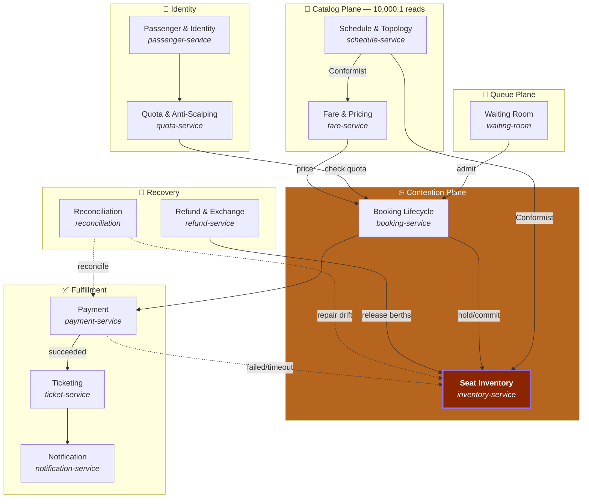

# 01 — Domain Model

## 1. Requirements

| ID | Requirement | Type | Note |
|---|---|---|---|
| R1 | Search trips by origin, destination, date | Functional | Very read-heavy |
| R2 | See berths free **for my specific journey** | Functional | Not "free on the train" — free on the legs I travel |
| R3 | Hold a berth long enough to pay | Functional | Releases itself on expiry |
| R4 | Pay via VNPay/MoMo | Functional | Third party, asynchronous, can time out |
| R5 | Receive an e-ticket with a QR code | Functional | |
| R6 | Exchange / refund per policy | Functional | Berths return to inventory **on exactly the legs they occupied** |
| R7 | Book several tickets for a family, **seated together** | Functional | Allocation constraint |
| **R8** | **Never oversell a single ticket** | **Invariant** | ⭐ The cardinal sin |
| **R9** | **Max 4 tickets per national ID per direction during Tết** | **Invariant** | Anti-scalping |
| R10 | Sale windows, released fairly | Functional | Virtual waiting room |
| R11 | Cancelled trip ⇒ notify and refund automatically | Functional | Bulk reverse saga |

### Non-functional — this is the hard part

| ID | Requirement | Target |
|---|---|---|
| **N1** | **Survive the sale opening** | 500,000 people in 60 seconds |
| N2 | Successful hold | p99 < 800 ms |
| N3 | Trip search | p95 < 150 ms (cached) |
| **N4** | **Overselling** | **Exactly 0. There is no "acceptable"** |
| N5 | Charged without a ticket | 0 — or refunded within 5 minutes |
| N6 | Fair queueing | Admission order = arrival order, <1% deviation |
| N7 | Redis dies | No paid berth is lost |

> **N4 is the constraint that shapes the whole system.** Every other architectural decision
> follows from protecting it. In this domain *slow* is annoying; *wrong* means two people
> holding tickets for the same bunk on a 33-hour journey.

---

## 2. Event Storming

```
━━━ PREPARATION (before the sale) ━━━━━━━━━━━━━━━━━━━━━━━━━━━━━━━━━━━━━━━━━━━
 [Schedule a trip]──▶ TripScheduled
        │  (SE1 runs on 14 Feb, carriages X, Y, Z)
        ▼
 [Generate berth inventory]──▶ InventoryInitialized
        │  500 berths × 29-leg bitmask, loaded into Redis + PostgreSQL
        ▼
 [Announce the sale window]──▶ SaleWindowAnnounced
        │  ⚠ HOTSPOT: everyone knows the sale opens at 08:00 tomorrow
        │    → 500k people waiting at second zero
        ▼
 SaleWindowOpened

━━━ GETTING IN ━━━━━━━━━━━━━━━━━━━━━━━━━━━━━━━━━━━━━━━━━━━━━━━━━━━━━━━━━━━━━
 [Request a queue slot]──▶ QueueTicketIssued
        │  ⚠ HOTSPOT: bots request 10,000 queue slots
        │    → fix: require identity verification BEFORE entering the queue
        ▼
 [Turn arrives]──▶ AdmittedToBooking
        │  Release N people/second into the real system
        ▼
 QueueTicketExpired  (unused for 15 minutes)

━━━ RESERVING ━━━━━━━━━━━━━━━━━━━━━━━━━━━━━━━━━━━━━━━━━━━━━━━━━━━━━━━━━━━━━━
 [Search trips]──▶ TripSearched
        ▼
 [Query availability for a journey]──▶ AvailabilityQueried
        │  ⚠ HOTSPOT: results are 2 seconds stale → user clicks a berth already taken
        │    → fix: treat the display as a SUGGESTION; the real decision is the hold
        ▼
 [Hold a berth]──▶ BerthHeld          |  BerthHoldRejected (already taken)
        │  ⚠⚠ THE BIGGEST HOTSPOT: 10,000 requests for one bunk
        │     → docs 03 and 04 exist entirely for this
        ▼
 [Check quota]──▶ QuotaChecked | QuotaExceeded
        │  ⚠ HOTSPOT: scalpers use 50 borrowed IDs
        ▼
 [Create order]──▶ BookingCreated
        │  One order = one payment, possibly several tickets
        ▼
 HoldExpiring (3 minutes left)  ──▶  HoldExpired ──▶ BerthReleased
        │                             ⚠ HOTSPOT: distributed timers for 100k holds
        ▼
━━━ PAYMENT ━━━━━━━━━━━━━━━━━━━━━━━━━━━━━━━━━━━━━━━━━━━━━━━━━━━━━━━━━━━━━━━━
 [Redirect to the payment gateway]──▶ PaymentInitiated
        │
        ├──▶ PaymentSucceeded ──▶ [Issue tickets]──▶ TicketIssued ──▶ TicketDelivered
        │
        ├──▶ PaymentFailed ─────▶ [Release berths]──▶ BerthReleased
        │
        └──▶ PaymentTimeout ────▶ ⚠⚠ HOTSPOT: charged, and we do not know it
             │                      → fix: reconciliation + automatic refund
             ▼
        PaymentReconciled | RefundIssued

━━━ AFTER ISSUANCE ━━━━━━━━━━━━━━━━━━━━━━━━━━━━━━━━━━━━━━━━━━━━━━━━━━━━━━━━━
 [Exchange]──▶ TicketExchanged   (release the old mask, take the new one — ATOMICALLY)
 [Refund]────▶ TicketRefunded ──▶ BerthReleased
 [Board]─────▶ TicketScanned ──▶ TicketUsed

━━━ DISRUPTION ━━━━━━━━━━━━━━━━━━━━━━━━━━━━━━━━━━━━━━━━━━━━━━━━━━━━━━━━━━━━━
 [Trip delayed]──▶ TripDelayed ──▶ (bulk notification)
 [Trip cancelled]──▶ TripCancelled
        │  ⚠ HOTSPOT: 500 tickets refunded automatically + alternatives suggested
        ▼
 BulkRefundInitiated ──▶ RefundIssued × N

━━━ BACKGROUND ━━━━━━━━━━━━━━━━━━━━━━━━━━━━━━━━━━━━━━━━━━━━━━━━━━━━━━━━━━━━━
 [Reconcile Redis ↔ PostgreSQL]──▶ DriftDetected ──▶ InventoryRepaired
        ⚠ HOTSPOT: two datastores, one truth. Doc 04 §6
```

### Hotspots and the decisions they force

| Hotspot | Problem | Decision |
|---|---|---|
| **Sale opening** | 500k people at second zero | **Virtual waiting room**: absorb the wave, release N/s. The backend never sees the surge |
| **One bunk contested** | 10k requests, 1 berth | Atomic Redis Lua, partitioned by trip. [04](04-contention-strategies.md) |
| Bots hoarding queue slots | Scalpers take 10k slots | Verify identity **before** queueing, not at payment |
| Stale availability display | User clicks a berth already gone | The display is a **suggestion**, not a promise. The UI says so; truth is the hold |
| 100k hold timers | Expiry must release on time | Redis TTL + keyspace notifications, with a sweep job as backup |
| Payment timeout | Charged and we do not know | **Reconciliation is mandatory** — not a nice-to-have |
| Scalpers with borrowed IDs | Identity quota is circumvented | Accept that 100% prevention is impossible; cap the damage and detect behavioural clusters |
| Exchange | Release old legs, take new ones | Must be **atomic** — a half-failed exchange loses both the old berth and the new |
| Redis dies | Holds not yet in PostgreSQL are lost | Losing an **unpaid** hold is acceptable; losing a **paid** ticket never is |

---

## 3. Bounded contexts



### Context relationships

| Upstream → Downstream | Pattern | Reason |
|---|---|---|
| Schedule → Inventory | **Conformist** | Inventory adopts Schedule's leg structure as-is. Translating would be pure overhead |
| Booking → Inventory | **Customer/Supplier** | Booking is the only client allowed to write inventory |
| Quota → Booking | **Open Host** | Quota serves several clients through a stable interface |
| Reconciliation → Inventory | **Deliberate back door** | The only context that may **repair** inventory outside the main flow |
| Payment → Booking | **Anti-Corruption Layer** | VNPay/MoMo have their own models; do not let them leak into the domain |

> **`inventory-service` has exactly ONE writing client: `booking-service`.** That is not
> incidental — it keeps invariant R8 defensible in one place. Refund and Reconciliation
> write through separate, audited APIs.

---

## 4. Ubiquitous language

This domain has **two pairs of words that get confused**, and confusing them produces bugs.

| Term | Definition | ❌ Do not call it |
|---|---|---|
| **Train** | A recurring service, e.g. "SE1" | "trip" |
| **Trip** | **One** specific run: SE1 on 2026-02-14 | "train", "schedule" |
| **Leg** | The stretch between two consecutive stations. The smallest inventory unit | "segment", "stop" |
| **Journey** | A passenger's origin → destination. Spans several legs | "trip" |
| **Berth** | A physical position: carriage 5, bunk 12, level 1 | "ticket", "seat" |
| **Ticket** | A document tying **one** passenger to a journey and a berth | "berth", "order" |
| **Booking** | One payment, containing 1–4 tickets | "ticket" |
| **Hold** | A temporary, expiring claim. **Not yet a ticket** | "reservation" |
| **OccupiedMask** | The bitmask of legs on which a berth is taken | — |
| **Quota** | The maximum tickets one identity may buy in a sale window | "limit" |
| **SaleWindow** | The period during which a group of trips is on sale | "the sale" |
| **QueueTicket** | A place in the virtual waiting room. **Not** a train ticket | "ticket" |

**The two pairs that cause most bugs:**

```
Train  ≠  Trip     SE1 is a Train. SE1-2026-02-14 is a Trip.
                   Inventory belongs to the TRIP, never to the Train.

Berth  ≠  Ticket   One Berth can produce SEVERAL Tickets on the same trip
                   (passenger A HN→Hue, passenger B DN→SG, same bunk 12).
                   This is a direct consequence of the segment model.
```

> Code convention: bounded context name = module name = Kafka topic prefix = K8s namespace.
> `inventory` → `inventory-service`, topic `inventory.berth-held.v1`, namespace `contention`.

---

## 5. Core aggregates

```
Trip (aggregate root)                    BerthInventory (aggregate root)
├── tripId = SE1-2026-02-14              ├── tripId
├── trainCode = "SE1"                    ├── berthId
├── serviceDate                          ├── carriageNo, berthNo, level
├── stops[]  (ordered, arrive/depart)    ├── classCode (SOFT_SLEEPER_4, ...)
│   └── HN(0) Vinh(1) ... SG(29)         ├── occupiedMask   : int32  ⭐
├── legCount = stops.length - 1          ├── heldMask       : int32  ⭐
├── carriages[]                          └── version
│   ├── carriageNo, type, layout
│   └── berths[]                         ⭐ THE SUPREME INVARIANT:
├── status: SCHEDULED|SELLING|             (occupiedMask & heldMask) == 0
│           CLOSED|DEPARTED|CANCELLED      and no hold or ticket overlaps a bit
└── saleWindow

Booking (aggregate root)                 Ticket (entity, owned by Booking)
├── bookingId                            ├── ticketId
├── contactIdentity (national ID)        ├── passengerName, passengerIdentity
├── status: HELD|PENDING_PAYMENT|        ├── tripId, berthId
│           CONFIRMED|EXPIRED|           ├── fromStopIdx, toStopIdx
│           CANCELLED|REFUNDED           ├── journeyMask : int32  ⭐
├── holdExpiresAt                        ├── fareVnd
├── tickets[] (1..4)                     └── status: ISSUED|USED|REFUNDED|EXCHANGED
├── totalVnd
└── paymentRef
```

### Invariants

| # | Invariant | Enforced by |
|---|---|---|
| **I1** | For any berth, no two tickets or holds have intersecting `journeyMask` | **Redis Lua (hot) + a constraint in PostgreSQL (cold)** |
| **I2** | `heldMask & occupiedMask == 0` | Redis Lua |
| I3 | A `Hold` expires exactly **once** | Redis TTL + idempotent consumer |
| I4 | Tickets per identity per direction ≤ 4 in a sale window | `quota-service`, Redis counter + PostgreSQL |
| I5 | `Booking.totalVnd` = sum of ticket `fareVnd` | PostgreSQL transaction |
| I6 | A `Ticket` always names exactly one passenger identity | Database constraint |
| I7 | A `DEPARTED` trip accepts no new holds | Trip state |

> **I1 is the entire reason this project exists.** It is defended at **two layers**: Redis
> Lua on the hot path (fast, not durable), PostgreSQL on the cold path (slow, durable).
> When the two disagree — and they **will** — `reconciliation` is the referee.
> See [04 §6](04-contention-strategies.md).

---

## 6. Two berth-selection modes

A product decision with a large effect on contention:

| Mode | How it works | Contention | Used when |
|---|---|---|---|
| **Pick your own** | Passenger sees the carriage map and taps the bunk they want | 🔴 Very high — everyone wants level 1 in a 4-berth compartment | Ordinary days |
| **Automatic** | Passenger picks a *class*, the system assigns a bunk | 🟢 Low — requests spread across every free berth | **Tết peak** |

**Switching modes is an operational lever**, not a code change. When `inventory-service`
sees the `BerthHoldRejected` rate cross a threshold, the system switches to automatic and
says so: *"Peak demand — we will pick the best available berth for you."*

This is a clean example of **reducing contention by product design rather than by
engineering** — and it works better than any lock optimisation.

---

## 7. Boundaries not to cross

| Temptation | Why it is wrong | Do this instead |
|---|---|---|
| Let `booking-service` write inventory in Redis directly | Two places hold invariant I1 ⇒ they will diverge | Only `inventory-service` touches inventory |
| Merge `quota` into `booking` | Quota is extremely read/write hot and has its own lifecycle (per sale window); booking's is per order | Keep them separate |
| One SQL row per berth per leg | 500 berths × 29 legs = 14,500 rows per trip; joins and locks become a nightmare | **One row per berth, a bitmask for legs** |
| Cache availability and treat it as truth | Two-second-old data means promising a berth and taking it back | Cache for **display**; truth exists only at the hold |
| Let `payment` call `inventory` directly | Payment is external and untrusted | Route through `booking` (the saga orchestrator) |
| Let `reconciliation` repair silently | Repairing inventory is a serious act | Every repair writes an audit record and raises an alert |

---

**Next:** [02 — Architecture](02-architecture.md)
