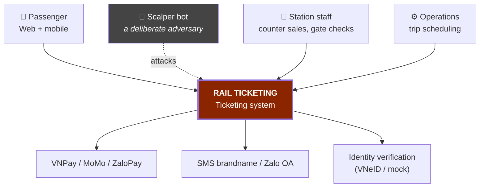
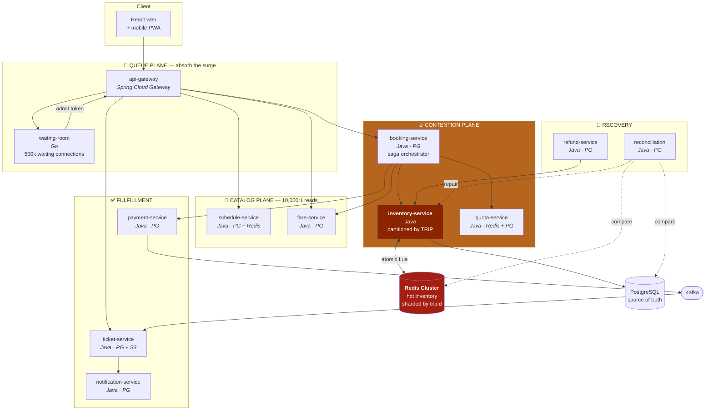

# 02 — Architecture

## 1. C4 Level 1 — System context



**The scalper bot is on the context diagram on purpose.** Most designs ignore the adversary
and then bolt on a "security" section. Here the scalper is a **primary actor**: it dictates
the waiting room design, the quota model, and the authentication flow.

### Degrading when a dependency fails

| External system | If it fails |
|---|---|
| VNPay/MoMo | Holds stay; tell the passenger to retry; **reconciliation is mandatory** once the gateway recovers |
| SMS/Zalo | Queue for redelivery. Tickets remain visible in the app |
| Identity verification | **Stop selling** — without verification there is no defence against scalpers. The only hard dependency |

---

## 2. C4 Level 2 — Containers



---

## 3. Why split by **load shape**

The usual split — by entity (`user`, `booking`, `ticket`) — hides what matters most here:
these groups have **fundamentally different load shapes and consistency needs**, and they
scale in mutually incompatible ways.

| Plane | Load | Consistency | Scales by | If it fails |
|---|---|---|---|---|
| **Queue** | 500k concurrent connections, almost no CPU | None needed | More pods (more connections) | The surge hits the backend directly |
| **Catalog** | 10,000:1 reads, **cold** data (schedules do not change) | Eventual, 24h TTL | Cache + replicas | Trips cannot be searched |
| **Contention** | Extremely contended writes to **the same few rows** | **Linearizable** | **Partition by trip** | ⛔ Overselling |
| **Fulfillment** | Moderate writes, tolerates delay | Eventual | Consumer groups | Tickets arrive late |
| **Recovery** | Background batch | Eventual | Not needed | Drift accumulates silently |

**The crux: the contention plane does not scale by adding replicas.** Adding 100 pods to
`inventory-service` makes it **slower** if they contend for the same row. It scales by
**partitioning on `tripId`** — each trip is an independent contention domain.

```
Wrong:   100 pods  ──▶ one inventory row       ──▶ locks queue, throughput ↓
Right:   100 pods  ──▶ 200 trips, 2 per pod    ──▶ zero contention between pods
```

This is the central lesson of the project: **contention is solved by partitioning, not by
replication.**

---

## 4. The two-tier inventory architecture

The heart of the system. Neither tier is sufficient alone.

```
              ┌─────────────────────────────────────┐
    HOT PATH  │  REDIS  — sharded by tripId         │
    (holds)   │  · Lua script = atomic              │
              │  · 4 KB per trip, one command       │
              │  · ~25,000 ops/s per shard          │
              │  · ❌ lost when Redis dies           │
              └──────────────┬──────────────────────┘
                             │ asynchronous write (outbox)
                             ▼
              ┌─────────────────────────────────────┐
    COLD PATH │  POSTGRESQL — source of truth       │
    (durable) │  · Paid tickets written SYNCHRONOUSLY│
              │  · Constraint prevents leg overlap  │
              │  · ✅ durable, backed up, PITR       │
              └──────────────┬──────────────────────┘
                             │
                             ▼
              ┌─────────────────────────────────────┐
    REFEREE   │  RECONCILIATION — every 60 seconds  │
              │  Compare Redis vs PostgreSQL masks  │
              │  On drift, PostgreSQL wins          │
              │  Audit record + alert               │
              └─────────────────────────────────────┘
```

**The risk-partitioning rule:**

| State | Can it be lost? | Stored in |
|---|---|---|
| **Unpaid** hold | ✅ Yes — the passenger retries | Redis (TTL) |
| Booking **awaiting payment** | ⚠️ Limited | Redis + PostgreSQL, async |
| **Paid** ticket | ❌ **Never** | **PostgreSQL synchronously**, then acknowledge |

This is where the CAP trade-off becomes concrete: accept losing holds (fast) in exchange
for never losing a paid ticket (durable). Detail:
[04 §5–6](04-contention-strategies.md).

---

## 5. The virtual waiting room — why it is its own service

500,000 people at second zero. No backend survives that. The waiting room **absorbs the
wave and releases it evenly**:

```
500,000 people ─▶ waiting-room ─▶ release 2,000/s ─▶ backend sees EVEN load
                  (Go, ~500 MB RAM)                   (like a normal day ×40)
```

| Property | Why |
|---|---|
| **Go, not Java** | 500k SSE/WebSocket connections. Go costs ~1 KB per goroutine; a JVM thread or reactive context costs many times that. A concrete engineering reason, not a preference |
| **No database** | A Redis sorted set is enough. A database would add a failure point at the most loaded place in the system |
| **Knows nothing about tickets** | It only issues an admission token. Fully decoupled from the domain |
| **Identity verified before queueing** | Otherwise bots take 10,000 queue slots and everything downstream is pointless |

The release rate is an **operational lever**: when `inventory-service` p99 climbs, slow the
release. This is backpressure at the product layer, and it beats every circuit breaker.

---

## 6. Technology decisions

| Decision | Choice | Also considered | Reason |
|---|---|---|---|
| Hot inventory path | **Redis + Lua** | Plain Postgres, Hazelcast, in-memory | Lua runs single-threaded and atomically ⇒ **no locks needed**. 4 KB per trip fits one command |
| Source of truth | **PostgreSQL** | Cassandra, DynamoDB | Booking and money need real transactions. A constraint prevents leg overlap |
| Waiting room | **Go** | Java WebFlux, Nginx+Lua | 500k idle connections — RAM per connection is the deciding metric |
| Everything else | **Java 21 + Spring Boot** | — | Virtual threads suit I/O-bound services; ecosystem |
| Events | **Kafka** | RabbitMQ, NATS | Partitioning by `tripId` gives **ordering within a trip**; replay rebuilds inventory |
| Load testing | **k6** | JMeter, Gatling | JavaScript, easy to simulate 10k VUs fighting over 500 berths |
| Bot defence | **Identity + quota**, not IP | Cloudflare, captcha | Rotating IPs is easy; rotating national IDs is hard |
| Deployment | **k3d, local** | Managed cloud K8s | The whole project runs on a 16 GB laptop for $0. Contention reproduces locally; only real network latency does not |

### Why Redis Lua instead of a distributed lock (Redlock)

Redlock solves *locking*, but we do not need a lock — we need an **atomic operation**.
Redis runs Lua single-threaded: a script that does `check mask → pick berth → set bits →
return` runs to completion without interleaving. No lock to acquire, none to release, none
to expire at the wrong moment.

One command, ~80 µs, absolutely correct within one shard.

---

## 7. Partitioning — the detail that decides whether this scales

```
tripId = "SE1-2026-02-14"
       │
       ├─ Redis:  hash slot on {tripId}  ⇒ all berths of a trip on the SAME node
       ├─ Kafka:  partition = hash(tripId) ⇒ event ordering within a trip
       └─ Pod:    consistent hashing      ⇒ each pod "owns" a set of trips
```

**The Redis hashtag `{tripId}` is mandatory.** Without it, a trip's berths scatter across
nodes and the Lua script cannot run — Lua may only touch keys in the same slot.

Result: **200 trips = 200 independent contention domains.** A total load of 500k/minute
becomes ~2,500/minute per trip, comfortably inside one Redis shard.

The remaining bottleneck: **one hot trip** (SE1 on the 26th day of the lunar year). That is
a physical limit of the problem, and it is why the waiting room exists — it spreads the same
demand over time.

---

## 8. Fault tolerance

| Pattern | Applied to | Configuration |
|---|---|---|
| **Product-layer backpressure** | waiting-room | Slow the release rate when p99 climbs — the most effective lever |
| Timeouts decreasing inward | Everywhere | Gateway 8s > booking 5s > inventory 800ms > Redis 200ms |
| Idempotency | Every write | `Idempotency-Key`, retained 24h |
| Outbox | Every publishing service | An `outbox` table in the same transaction + CDC |
| **Reconciliation** | Redis ↔ PostgreSQL | Every 60 seconds, PostgreSQL wins |
| Circuit breaker | Payment calls | A slow payment gateway must not drag booking down |
| **Automatic berth assignment** | inventory | Enabled when the rejection rate exceeds 30% — contention reduced by product design |

**Order of sacrifice under overload:**

```
1. Disable pick-your-own berth → switch to automatic assignment  ← cuts contention immediately
2. Slow the waiting room release rate
3. Disable detailed availability (show only "available / sold out")
4. Disable exchanges (keep refunds)
5. ─── never sacrificed ───
   · Issuing tickets for PAID orders
   · Reconciliation
```

---

## 9. Security and fraud

| Layer | Measure |
|---|---|
| Entering the queue | Identity verification **first**, not at payment |
| Quota | 4 tickets per ID per direction per sale window. Checked in Redis (hot) + PostgreSQL (durable) |
| Cluster detection | Many IDs from one device / one phone number receiving tickets / one payment instrument ⇒ flag |
| Identity-bound tickets | Gate checks match the national ID ⇒ a resold ticket is unusable |
| Rate limiting | By **identity**, not by IP |
| Audit | Every inventory repair by `reconciliation` writes an immutable log entry |

> **An honest admission:** scalping cannot be stopped completely. Borrowed and rented IDs
> are real. The goal is to **raise the cost of attack** and **cap the damage**, not to
> eliminate it. A design that promises elimination has not understood the problem.

---

**Next:** [03 — Segment Inventory Engine](03-segment-inventory-engine.md)
