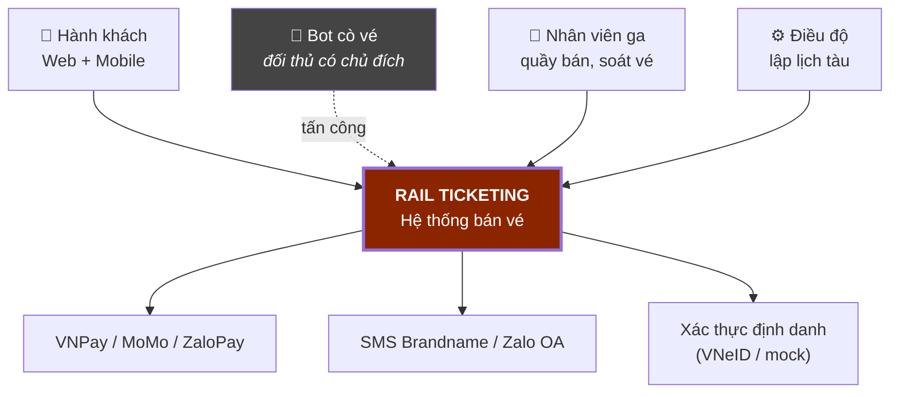
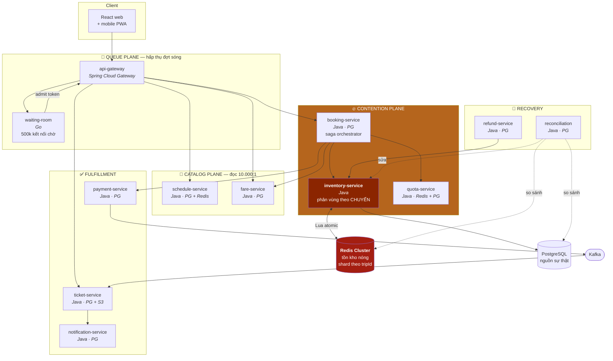

# 02 — Architecture

## 1. C4 Level 1 — System Context



**Bot cò vé được vẽ vào sơ đồ context có chủ đích.** Đa số thiết kế bỏ qua đối thủ, rồi
xử lý như một mục "bảo mật" phụ. Ở domain này, cò vé là **tác nhân chính**: nó quyết định
thiết kế phòng chờ, quota, và cả luồng xác thực.

### Suy giảm khi phụ thuộc ngoài hỏng

| Hệ thống ngoài | Hỏng thì sao |
|---|---|
| VNPay/MoMo | Hold vẫn giữ; báo khách thử lại; **đối soát bắt buộc** khi cổng tỉnh lại |
| SMS/Zalo | Xếp hàng gửi lại. Vé vẫn xem được trong app |
| Xác thực định danh | **Chặn bán** — không xác thực được thì không chống được cò vé. Đây là phụ thuộc cứng duy nhất |

---

## 2. C4 Level 2 — Container



---

## 3. Vì sao chia theo **hình dạng tải**

Cách chia service thông thường — theo thực thể (`user`, `booking`, `ticket`) — che mất điều quan trọng nhất ở đây: bốn nhóm chức năng có **hình dạng tải và yêu cầu nhất quán khác nhau về bản chất**, và chúng scale theo những cách không tương thích với nhau.

| Plane | Tải | Nhất quán | Scale bằng | Hỏng thì |
|---|---|---|---|---|
| **Queue** | 500k kết nối đồng thời, CPU gần 0 | Không cần | Thêm pod (nhiều kết nối) | Sóng đập thẳng vào backend |
| **Catalog** | Đọc 10.000:1, dữ liệu **lạnh** (lịch tàu không đổi) | Eventual, TTL 24h | Cache + replica | Không tra được chuyến |
| **Contention** | Ghi tranh chấp cực cao vào **cùng vài dòng** | **Tuyến tính hoá** | **Phân vùng theo chuyến** | ⛔ Bán thừa vé |
| **Fulfillment** | Ghi vừa phải, chịu được chậm | Eventual | Consumer group | Vé giao chậm |
| **Recovery** | Batch nền | Eventual | Không cần | Sai lệch tích tụ âm thầm |

**Điểm mấu chốt: Contention plane không scale bằng cách thêm replica.** Thêm 100 pod cho
`inventory-service` **làm chậm hơn** nếu chúng tranh cùng một dòng. Nó scale bằng
**phân vùng theo `tripId`** — mỗi chuyến là một miền tranh chấp độc lập.

```
Sai:     100 pod  ──▶ cùng 1 dòng tồn kho  ──▶ khoá xếp chồng, throughput ↓
Đúng:    100 pod  ──▶ 200 chuyến, mỗi pod lo 2 chuyến  ──▶ 0 tranh chấp giữa pod
```

Đây là bài học trung tâm của cả dự án: **tranh chấp giải bằng phân vùng, không bằng nhân bản.**

---

## 4. Kiến trúc hai tầng của tồn kho

Trái tim hệ thống. Không có tầng nào một mình đủ.

```
              ┌─────────────────────────────────────┐
   ĐƯỜNG NÓNG │  REDIS  — shard theo tripId         │
   (giữ chỗ)  │  · Script Lua = nguyên tử           │
              │  · 4 KB/chuyến, vừa 1 lệnh          │
              │  · ~25.000 op/giây/shard            │
              │  · ❌ mất khi Redis chết             │
              └──────────────┬──────────────────────┘
                             │ ghi bất đồng bộ (outbox)
                             ▼
              ┌─────────────────────────────────────┐
   ĐƯỜNG NGUỘI│  POSTGRESQL — nguồn sự thật         │
   (bền vững) │  · Vé đã thanh toán ghi ĐỒNG BỘ     │
              │  · CHECK ràng buộc chống chồng chặng│
              │  · ✅ bền, có backup, PITR           │
              └──────────────┬──────────────────────┘
                             │
                             ▼
              ┌─────────────────────────────────────┐
   TRỌNG TÀI  │  RECONCILIATION — mỗi 60 giây       │
              │  So bitmask Redis vs PostgreSQL     │
              │  Lệch ⇒ PostgreSQL thắng, sửa Redis │
              │  Ghi kiểm toán + cảnh báo           │
              └─────────────────────────────────────┘
```

**Quy tắc phân chia rủi ro:**

| Trạng thái | Mất được không? | Lưu ở đâu |
|---|---|---|
| Hold **chưa thanh toán** | ✅ Được — khách thử lại | Redis (TTL) |
| Booking **đang chờ thanh toán** | ⚠️ Hạn chế | Redis + PostgreSQL async |
| Vé **đã thanh toán** | ❌ **Không bao giờ** | **PostgreSQL đồng bộ**, rồi mới xác nhận |

Đây là chỗ đánh đổi CAP hiện ra cụ thể: chấp nhận mất hold (nhanh) để đổi lấy không bao giờ
mất vé đã trả tiền (bền). Chi tiết: [04 §5–6](04-contention-strategies.md).

---

## 5. Phòng chờ ảo — vì sao nó là service riêng

500.000 người ở giây thứ 0. Không backend nào chịu nổi. Phòng chờ **hấp thụ sóng và xả đều**:

```
500.000 người ─▶ waiting-room ─▶ xả 2.000/giây ─▶ backend thấy tải ĐỀU
                  (Go, ~500 MB RAM)                 (như ngày thường ×40)
```

| Thuộc tính | Vì sao |
|---|---|
| **Go, không phải Java** | 500k kết nối SSE/WebSocket. Go ~1 KB/goroutine; JVM thread hoặc reactive context tốn gấp nhiều lần. Đây là lý do kỹ thuật cụ thể, không phải sở thích |
| **Không có database** | Redis sorted set là đủ. Thêm DB là thêm điểm hỏng ở chỗ chịu tải nặng nhất |
| **Không biết gì về vé** | Chỉ cấp token vào cửa. Tách hoàn toàn khỏi miền nghiệp vụ |
| **Xác thực CCCD trước khi vào hàng** | Nếu không, bot lấy 10.000 slot hàng đợi và mọi thứ phía sau vô nghĩa |

Tốc độ xả là **cần gạt vận hành**: thấy `inventory-service` p99 tăng thì giảm tốc độ xả.
Đây là backpressure ở tầng sản phẩm, và nó hiệu quả hơn mọi circuit breaker.

---

## 6. Bảng quyết định công nghệ

| Quyết định | Chọn | Đã cân nhắc | Lý do |
|---|---|---|---|
| Tồn kho đường nóng | **Redis + Lua** | Postgres thuần, Hazelcast, in-memory | Lua chạy nguyên tử single-thread ⇒ **không cần khoá**. 4 KB/chuyến vừa một lệnh |
| Nguồn sự thật | **PostgreSQL** | Cassandra, DynamoDB | Cần transaction thật cho booking + tiền. Ràng buộc CHECK chống chồng chặng |
| Phòng chờ | **Go** | Java WebFlux, Nginx+Lua | 500k kết nối rỗi — RAM/kết nối là chỉ số quyết định |
| Phần còn lại | **Java 21 + Spring Boot** | — | Virtual threads hợp service I/O-bound; hệ sinh thái |
| Event | **Kafka** | RabbitMQ, NATS | Phân vùng theo `tripId` cho **thứ tự trong một chuyến**; replay khi dựng lại tồn kho |
| Load test | **k6** | JMeter, Gatling | Viết bằng JS, dễ mô phỏng 10k VU tranh 500 chỗ |
| Chống bot | **Định danh + quota**, không phải IP | Cloudflare, captcha | Cò vé xoay IP dễ; xoay CCCD khó |
| Deploy | **k3d local** | Cloud managed K8s | Toàn bộ dự án chạy được trên laptop 16 GB, $0. Tranh chấp mô phỏng được ở local; chỉ độ trễ mạng thật là không |

### Vì sao Redis Lua thay vì khoá phân tán (Redlock)

Redlock giải bài toán *khoá*, nhưng ở đây ta không cần khoá — ta cần **thao tác nguyên tử**.
Redis chạy Lua đơn luồng: script `kiểm tra mask → chọn chỗ → set bit → trả về` chạy trọn vẹn
không bị xen. Không có khoá để lấy, không có khoá để nhả, không có khoá hết hạn sai lúc.

Một lệnh, ~80 µs, đúng tuyệt đối trong phạm vi một shard.

---

## 7. Phân vùng — chi tiết quyết định khả năng scale

```
tripId = "SE1-2026-02-14"
       │
       ├─ Redis:   hash slot theo {tripId}  ⇒ toàn bộ chỗ của chuyến ở CÙNG node
       ├─ Kafka:   partition = hash(tripId) ⇒ thứ tự event trong chuyến được bảo đảm
       └─ Pod:     consistent hashing       ⇒ mỗi pod "sở hữu" một tập chuyến
```

**Hashtag Redis `{tripId}` là bắt buộc.** Không có nó, các chỗ của cùng một chuyến rải ra
nhiều node ⇒ script Lua không chạy được (Lua chỉ thao tác được key trên cùng slot).

Kết quả: **200 chuyến = 200 miền tranh chấp độc lập.** Tải tổng 500k/phút chia ra
~2.500/phút mỗi chuyến — hoàn toàn trong tầm của một shard Redis.

Nghẽn còn lại: **một chuyến hot** (SE1 chiều 26 Tết). Đó là giới hạn vật lý của bài toán,
và là lý do phòng chờ tồn tại — nó rải cùng lượng nhu cầu đó ra theo thời gian.

---

## 8. Khả năng chịu lỗi

| Mẫu | Áp dụng | Cấu hình |
|---|---|---|
| **Backpressure ở tầng sản phẩm** | waiting-room | Giảm tốc độ xả khi p99 tăng — hiệu quả nhất |
| Timeout giảm dần vào trong | Toàn hệ | Gateway 8s > booking 5s > inventory 800ms > Redis 200ms |
| Idempotency | Mọi lệnh ghi | `Idempotency-Key`, Redis 24h |
| Outbox | Mọi service publish | Bảng `outbox` cùng transaction + CDC |
| **Đối soát** | Redis ↔ PostgreSQL | Mỗi 60 giây, PostgreSQL thắng |
| Circuit breaker | Gọi payment | Cổng thanh toán chậm không được kéo sập booking |
| **Chế độ tự động gán chỗ** | inventory | Bật khi tỉ lệ từ chối > 30% — giảm tranh chấp bằng sản phẩm |

**Thứ tự hy sinh khi quá tải:**

```
1. Tắt chế độ tự chọn chỗ → chuyển tự động gán    ← giảm tranh chấp ngay
2. Giảm tốc độ xả phòng chờ
3. Tắt tra cứu chỗ trống chi tiết (chỉ hiện "còn/hết")
4. Tắt đổi vé (giữ trả vé)
5. ─── không bao giờ hy sinh ───
   · Xuất vé cho đơn ĐÃ THANH TOÁN
   · Đối soát
```

---

## 9. Bảo mật & chống gian lận

| Lớp | Biện pháp |
|---|---|
| Vào phòng chờ | Bắt buộc xác thực định danh **trước**, không phải lúc thanh toán |
| Quota | 4 vé/CCCD/chiều/đợt. Kiểm ở Redis (nóng) + PostgreSQL (bền) |
| Phát hiện cụm | Nhiều CCCD cùng thiết bị / cùng số điện thoại nhận vé / cùng cách trả tiền ⇒ gắn cờ |
| Vé gắn danh tính | Soát vé đối chiếu CCCD ⇒ vé bán lại không dùng được |
| Rate limit | Theo **danh tính**, không theo IP |
| Kiểm toán | Mọi lần `reconciliation` sửa tồn kho ghi log bất biến |

> **Thừa nhận trung thực:** không chặn được 100% cò vé. CCCD mượn/thuê là có thật.
> Mục tiêu là **nâng chi phí tấn công** và **giới hạn thiệt hại**, không phải diệt tận gốc.
> Thiết kế nào hứa diệt tận gốc là thiết kế chưa hiểu bài toán.

---

**Tiếp theo:** [03 — Segment Inventory Engine](03-segment-inventory-engine.md)
